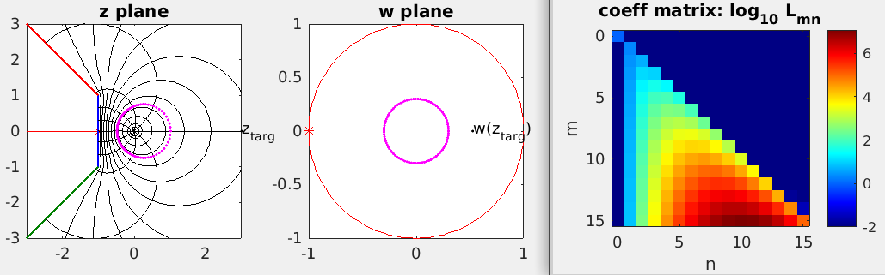

# taylor-resum

Numerical tool for resummation of a Taylor series via conformal mapping.

Just initial MATLAB experiments for now, including version which uses
the Schwarz-Christoffel toolbox to handle general polygonal regions.

Author: Alex Barnett. 7/31/19.


### The task

Let
<a href="https://www.codecogs.com/eqnedit.php?latex=\inline&space;f(z)&space;=&space;\sum_{n\ge0}a_n&space;z^n" target="_blank"></a>
be a function analytic at the origin, for which the Taylor coefficients
_a_<sub>0</sub>..._a_<sub>_p_</sub> are given.
Let
<a href="https://www.codecogs.com/eqnedit.php?latex=\inline&space;\Omega\subset\mathbb{C}\cup\{\infty\}" target="_blank"></a>
be a (possibly unbounded) simply-connected domain containing 0
in which _f_ is assumed to be analytic.
The task is to evaluate _f_ at a target _z_ in &Omega; but which is
outside the disc of convergence of this Taylor series.
Clearly the knowledge that &Omega; includes points outside this disc
must be used.

Applications include: quantum systems where Taylor coeffs at origin
are given by diagrammatic or QMC methods, but there are known singularities
and branch cuts near by.



### Prerequisites

* MATLAB. Tested with version R2017a.
* [SC Toolbox](http://www.math.udel.edu/~driscoll/SC/). Tested with version 2.4.1.

### Installation

Install MATLAB and the SC Toolbox.
Follow the above green button to clone this repo into your own directory.
In the code `setupsc.m`, change the `addpath` command to point to your
SC Toolbox directory.

From MATLAB, run `resum_log_demo`, which should produce figures including the above, and output something like:

```
>> resum_log_demo
ftrue =
          1.38629436111989
check inv map good: 3.51e-16
est L rel acc: 3.78e-08
ftarg =
           1.38629167735975 +  2.26828892182112e-06i
ztarg=(3,0): f rel err = -1.94e-06
```

This illustrates 6-digit accuracy in the evaluation of log(1+_z_) at
_z_=3+0i from _p_=15 terms of the Taylor series at 0, using a map to
an unbounded polygon.


### The method

Let _z_(_w_) be the conformal map (called `iw` in the code) taking the unit disc
<a href="https://www.codecogs.com/eqnedit.php?latex=\inline&space;D:=\{w\in\mathbb{C}:|w|<1\}" target="_blank"></a>
to &Omega; and 0 to 0.
See above figure for &Omega; (left plot) and _D_ (right plot).
By our assumption on _f_,

<a href="https://www.codecogs.com/eqnedit.php?latex=\tilde&space;f(w)&space;:=&space;f(z(w))=\sum_{n\ge0}c_nw^n&space;\hspace{1in}&space;(\ast)" target="_blank"></a>

is convergent in _D_.
It is easy to show that there is a lower-triangular matrix _L_,
independent of _f_, mapping the coefficients via

<a href="https://www.codecogs.com/eqnedit.php?latex=c_m=\sum_{n\le&space;m}&space;L_{mn}a_n,&space;\qquad&space;m=0,1,\dots" target="_blank"></a>

We approximate a finite block of this matrix 
<a href="https://www.codecogs.com/eqnedit.php?latex=\inline&space;\{L_{mn}\}_{0\le&space;m,n&space;\le&space;p}" target="_blank"></a>
using only application of _z_(_w_), by evaluating each monomial
_z_<sup>_n_</sup> at the points _z_(_r_ e<sup>2 &pi; _ij/N_</sup>)
for _j_=1,...,_N_.
One must choose a suitable radius _r_ and number of points _N_, and check
stability with respect to these two parameters (in practice choosing
_N_ is easy, and it seems there is a range of _r_ that is stable).
See `matrixfrominvmap.m`.

Finally, given the vector _a_<sub>0</sub>,...,_a_<sub>p</sub>
we hit it with _L_ to get the _c_ coefficients
then use (*) to evaluate the Taylor series for 
<a href="https://www.codecogs.com/eqnedit.php?latex=\inline&space;\tilde&space;f" target="_blank"></a> at _w_(_z_), for any desired
target _z_.

Note that _L_ involves exponentially large entries.

### Code usage

* `matrixfrominvmap.m` : the main utility which outputs the first _p_-by-_p_ block of the lower-triangular coefficient-mapping matrix _L_, given only a function handle of the map from _w_ to _z_, and a radius _r_. Called without arguments, a self-test demo is done.

* `resum_log_demo.m` : the demo which tests the idea for function _f_(_z_) = log(1+_z_), allowing two different choices of conformal map. All plotting code sections within `if verb, ..., end` can be removed to leave the math.


To create polygons in the SC Toolbox, vertices must be in counter-clockwise order. Here are some notes:

* bounded polygons: vertices as complex numbers, ie `p = polygon([z1 z2 ... zN]);`

* unbounded polygons: for an infinite vertex, give `Inf`.
Interior corner angles divided by pi must also be provided
(these are called alpha's), ie
ie `p = polygon([z1 z2 ... zN], [a1 a2 ... aN]);`. Note that the alphas must
sum to _N_-2, where _N_ is the number of vertices (including 
It appears _N_ must be at least 3, so that a half-space requires one vertex
more than one might think.

See the [SC user guide](http://www.math.udel.edu/~driscoll/SC/guide.pdf)
for polygon examples.

